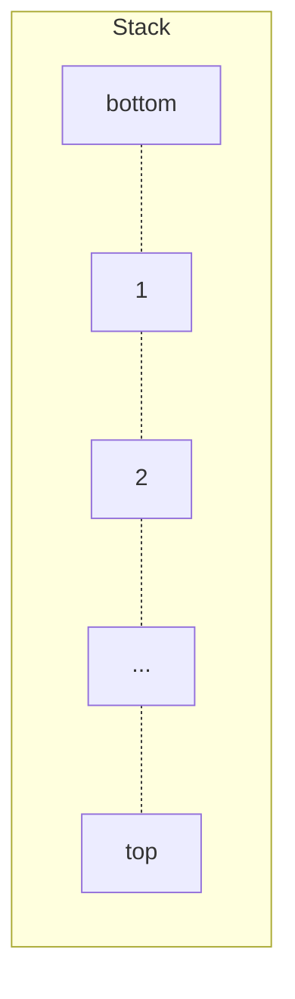

# 数据结构 栈 Stack

栈是一种遵循**后进先出原则**(LIFO)的有序集合。新添加的或待删除的元素都保存在栈的末尾，称为栈顶，另一端就叫栈底。在栈里，新元素都靠近栈顶，就元素都接近栈底。

栈也被用在编程语言的编译器和内存中保存变量、方法调用等。



## 栈的功能

- push 入栈
- pop 出栈
- isEmpty 判空
- size 大小
- peek 栈顶元素
- clear 清空
- printAll 打印全部

## 栈的实现

```js
// Stack.js
module.exports = function Stack() {
  var items = [];
  this.push = function (item) {
    items.push(item);
  };
  this.pop = function () {
    return items.pop();
  };
  this.peek = function () {
    return items[items.length - 1];
  };
  this.isEmpty = function () {
    return items.length == 0;
  };
  this.size = function () {
    return items.length;
  };
  this.clear = function () {
    items = [];
    return true;
  };
  this.print = function () {
    console.log(items.toString());
  };
};
```

## 栈的应用

### 应用 1 进制转换

```js
// Stack.1.js
const Stack = require("./Stack.js");
function baseConverter(decNumber, base) {
  let remStack = new Stack();
  let rem = 0;
  let = baseString = "";
  let digits = "0123456789ABCDEF";
  while (decNumber > 0) {
    rem = Math.floor(decNumber % base);
    remStack.push(rem);
    decNumber = Math.floor(decNumber / base);
  }
  while (!remStack.isEmpty()) {
    baseString += digits[remStack.pop()]; //{7}
  }
  return baseString;
}
```
