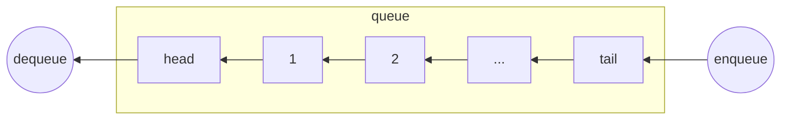

# 数据结构 队列 Queue

队列是遵循**先进先出原则**(FIFO)的一组有序的项。队列在尾部添加新元素，并在顶部移除元素。最新添加的元素必须排在队列的末尾。



## 队列的功能

- enqueue 入队列
- dequeue 出队列
- front 队列头部
- size 大小
- isEmpty 判空
- clear 清空
- print 打印全部

## 队列的实现

```js
// Queue.js
function Queue() {
  const items = [];
  this.enqueue = function (item) {
    items.push(item);
  };
  this.dequeue = function () {
    return items.shift();
  };
  this.front = function () {
    return items[0];
  };
  this.size = function () {
    return items.length;
  };
  this.isEmpty = function () {
    return items.length == 0;
  };
  this.clear = function () {
    items = [];
  };
  this.print = function () {
    console.log(items.toString());
  };
}
module.exports = Queue;
```

## 队列的应用

### 应用 1 优先队列

在队列的基础上引入优先级的概念

```js
function PriorityQueue() {
  const items = [];
  function QueueElement(element, priority) {
    this.element = element;
    this.priority = priority;
  }
  this.enqueue = function (element, priority) {
    var queueElement = new QueueElement(element, priority);
    if (this.isEmpty()) {
      items.push(queueElement);
    } else {
      var added = false;
      // 按照优先级进行插入
      for (var i = 0; i < items.length; i++) {
        if (queueElement.priority < items[i].priority) {
          items.splice(i, 0, queueElement);
          added = true;
          break;
        }
      }
      if (!added) {
        items.push(queueElement);
      }
    }
  };
}
```
