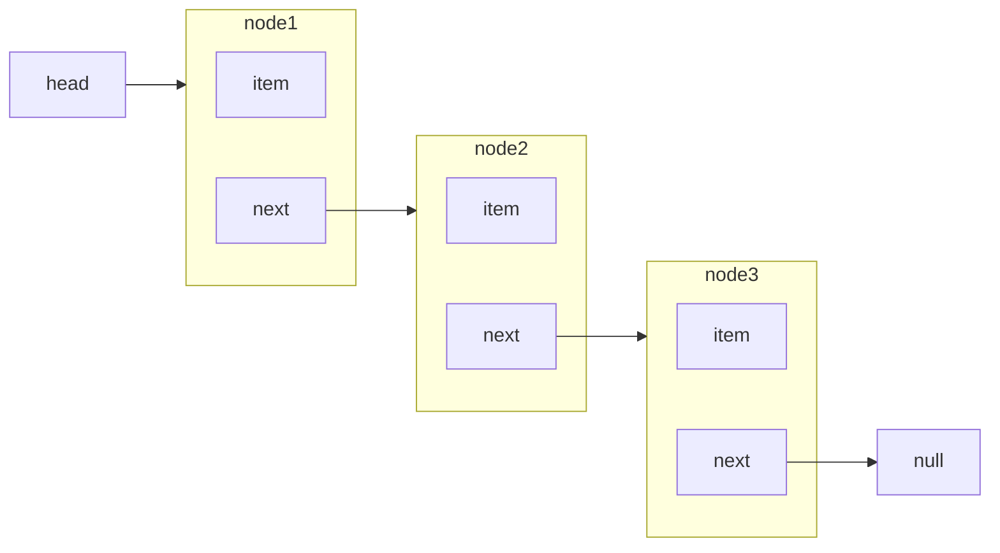

# 数据结构 链表 Linked List

在大多数语言中，数组的大小是固定的，从数组的起点或中间插入或移除项的成本是很高的，因为需要移动其后的所有元素。

链表存储有序的元素集合，但不同于数组，链表中的元素在内存中并不是连续放置的。每个元素由一个存储元素本身的结点和一个指向下一个元素的引用组成。



相对于传统的数组，链表的一个好处在于，**添加或移除**元素的时候不需要移动其他元素。

缺点在于要向访问链表中的一个元素，需要从起点开始迭代列表知道找到所需的元素。

## 链表的功能

- append 追加元素
- insert 按位置插入
- removeAt 按位置移除
- remove 按值移除
- indexOf 查找位置
- get 访问节点
- getHead 访问表头
- isEmpty 判空
- size 大小
- print 打印

## 链表的实现

```js
// Linkedlist.js
// 节点构造函数
let Node = function (item) {
  this.item = item;
  this.next = null;
};

// 链表构造函数
function LinkedList() {
  // 定义链表长度
  this.length = 0;
  // 定义头节点指针
  this.head = null;
}
module.exports = LinkedList;
```

### 追加

```js
// 链表中追加节点的方法 O(n)
LinkedList.prototype.append = function (item) {
  const node = new Node(item);
  let current; // 当前指针
  if (this.head === null) {
    this.head = node;
  } else {
    current = this.head;
    // 一直往后找，找到最后一项
    while (current.next) {
      current = current.next;
    }
    // 在最后一项后追加元素
    current.next = node;
  }
  // 更新链表长度
  this.length += 1;
  return true;
};
```

### 插入

```js
// 插入节点 O(n)
LinkedList.prototype.insert = function (position, item) {
  if (position < 0 || position > this.length) return false;
  const node = new Node(item);
  let current = this.head;
  let previous;
  let index = 0;
  if (position == 0) {
    // 在头部插入节点
    node.next = current;
    head = node;
  } else {
    // 一直往后找，找到index==position为止
    while (index++ < position) {
      previous = current;
      current = current.next;
    }
    // 将目标节点的前节点的后继指针指向插入节点
    previous.next = node;
    // 将插入节点的后继指针指向目标节点的后继指针
    node.next = current.next;
  }
  // 链表长度加一
  length++;
  // 插入操作成功，返回true
  return true;
};
```

### 移除

```js
// 移除指定位置的节点 O(n)
LinkedList.prototype.removeAt = function (position) {
  if (position > -1 && position < this.length) {
    let current = this.head;
    let previous;
    let index = 0;
    if (position == 0) {
      // 移除当前head节点，将head指针指向当前head的next
      head = current.next;
    } else {
      // 一直往后找，找到index == position为止
      while (index++ < position) {
        previous = current;
        current = current.next;
      }
      // 删除操作
      // 将当前节点的前节点的后继指针指向当前节点的后继指针
      previous.next = current.next;
    }
    // 链表长度减一
    this.length -= 1;
    // 返回被删除的节点
    return current.item;
  } else {
    return null;
  }
};
```

```js
// 移除指定值的节点 O(n)
LinkedList.prototype.remove = function (item) {
  const index = this.indexOf(item);
  return this.removeAt(index);
};
```

### 查找

```js
// 找到对应节点的位置 O(n)
LinkedList.prototype.indexOf = function (item) {
  // 基本操作走一波
  let current = this.head;
  let index = 0;
  // 找到目标节点
  while (index < this.length) {
    if (item == current.item) {
      return index;
    }
    current = current.next;
    index += 1;
  }
};
```

```js
// 访问某个位置的节点
LinkedList.prototype.get = function (order) {
  if (order > this.length) return null;
  let current = this.head;
  let index = 0;
  // 找到目标节点
  while (index < order) {
    current = current.next;
    // 注意 在这里 index++
    index += 1;
  }
  return current;
};
```

### 其他

```js
// 获取头节点
LinkedList.prototype.getHead = function () {
  return this.head;
};
// 判断是否为空
LinkedList.prototype.isEmpty = function () {
  return this.length == 0;
};
// 获取链表长度
LinkedList.prototype.size = function () {
  return this.length;
};
```

```js
// 打印链表中的item，按顺序排列
LinkedList.prototype.toString = function () {
  let current = this.head;
  let str = "";
  while (current) {
    str += current.item;
    current = current.next;
  }
  return str;
};
```

### 测试

```js
// LinkedList.test.js
const LinkedList = require("./LinkedList.js");
const list = new LinkedList();
list.append(1);
console.log(list.toString() == "1");
list.append(2);
console.log(list.toString() == "12");
list.append(3);
console.log(list.toString() == "123");
console.log(list.indexOf(3) == 2);
list.remove(2);
console.log(list.toString() == "13");
console.log(list.indexOf(3) == 1);
console.log(list.isEmpty() == false);
console.log(list.size() == 2);
console.log(list.getHead() == list.get(0));
```
