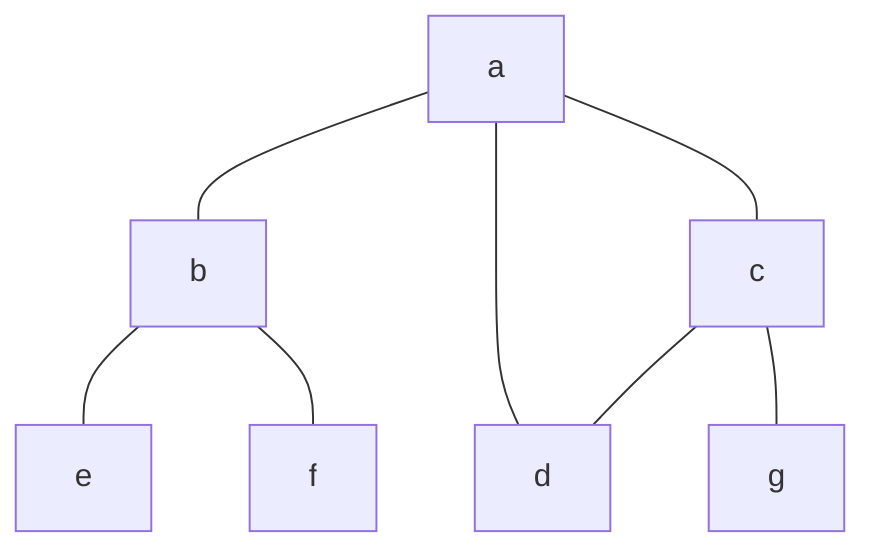
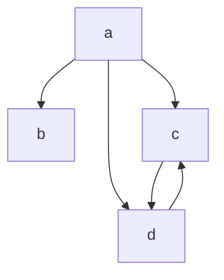
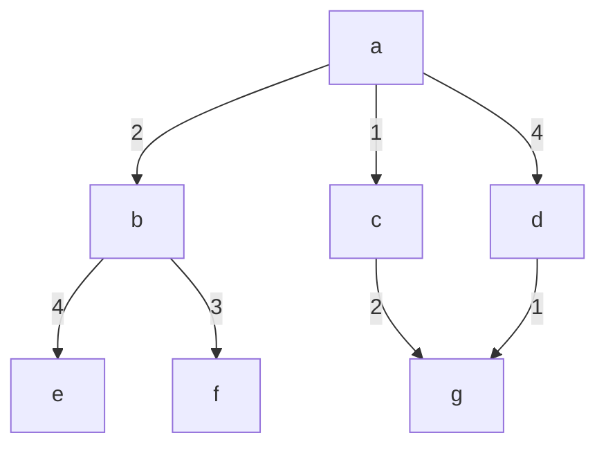
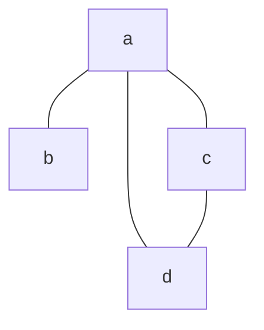

# 数据结构 图 Graph

图是网络结构的抽象模型，图是一组由边组成的节点。学习图是很重要的，因为任何二元关系都可以用图来表示。

一个图`$G=(v,E)$`由以下元素组成。V：一组的顶点，E：一组边



和图相关的一些术语

由一条边连接在一起的顶点成为相邻顶点

一个顶点的度是其相邻顶点的数量

路径是顶点`$v_1$,$v_2$,$***$,$v_k$`的一个连续序列，其中两两相邻

简单路径要求不包含重复的顶点

如果图中不存在环，则称该图是无环的。

如果途中每两个顶点间都存在路径，则该图是连通

## 有向图和无向图



图可以是无向的也可以是有向的。如果图中每两个顶点间在**双向上都存在路径**，则该图是强连通的。比如上图中 C 和 D**强连通**，A 和 B 不是强连通的。

图还可以是加权或者未加权的，如下图，加权图的边被赋予了权值



我们可以使用图来解决计算机科学世界中的很多问题，比如搜索图中的一个特定顶点或搜索一条特定边，寻找图中的一条路径，寻找两个顶点之间的最短路径，已经是否有环的检测。

## 图的表示方法

邻接矩阵，用一个二维数组来表示顶点之间的连接，空间复杂度`$O(n^2)$`

邻接表，由图中每个顶点的相邻顶点列表组成，最差空间复杂度`$O(n^2)$`

关联矩阵，矩阵的行表示顶点，列表示边



| 邻接矩阵 | a   | b   | c   | d   |
| -------- | --- | --- | --- | --- |
| a        | 0   | 1   | 1   | 1   |
| b        |     | 0   | 0   | 0   |
| c        |     |     | 0   | 1   |
| d        |     |     |     | 0   |

| 邻接表 |     |     |     |     |
| ------ | --- | --- | --- | --- |
| a      | b   | c   | d   |     |
| b      | a   |     |     |     |
| c      | a   | d   |     |     |
| d      | a   | c   |     |     |

| 关联矩阵 | a-b | a-c | a-d | c-d |
| -------- | --- | --- | --- | --- |
| a        | 1   | 1   | 1   | 0   |
| b        | 1   | 0   | 0   | 0   |
| c        | 0   | 1   | 0   | 1   |
| d        | 0   | 0   | 1   | 1   |

## 图的实现

```js
const Dictionary = require("./Dictionary.js");
const Queue = require("./Queue.js");

function Graph() {
  // 一个数组存储顶点
  var vertices = [];
  // 一个字典存储邻接表
  var adjList = new Dictionary();
  // 添加一个顶点
  this.addVertex = function (v) {
    vertices.push(v);
    adjList.set(v, []);
  };
  // 添加边
  this.addEdge = function (v, w) {
    adjList.get(v).push(w);
    adjList.get(w).push(v);
  };
  this.toString = function () {
    var s = "";
    // 遍历顶点
    for (let i = 0; i < vertices.length; i++) {
      s += vertices[i] + " -> ";
      // 获取改顶点的邻接元素
      let neighbors = adjList.get(vertices[i]);
      // 遍历邻接元素
      for (let j = 0; j < neighbors.length; j++) {
        s += neighbors[j] + " ";
      }
      s += "\n";
    }
    return s;
  };
  let initializeColor = function () {
    let color = [];
    // 遍历所有顶点 初始化颜色
    for (let i = 0; i < vertices.length; i++) {
      color[vertices[i]] = "white";
    }
    return color;
  };
  // BFS 广度优先遍历
  // 1. 创建一个队列Q
  // 2. 将v标注为被发现的，并将v入队列Q
  // 3. 如果Q非空
  //    3.1 将u从Q中出队列
  //    3.2 将标注u为被发现的
  //    3.3 将u所有未被访问的邻点如队列
  //    3.4 将u标注为已被探索的

  // 广度优先  队列和遍历
  this.bfs = function (v, callback) {
    let color = initializeColor();
    let queue = new Queue();
    // 最短路径
    let d = [];
    let pred = [];
    queue.enqueue(v);
    for (let i = 0; i < vertices.length; i++) {
      d[vertices[i]] = 0;
      pred[vertices[i]] = null;
    }

    while (!queue.isEmpty()) {
      let u = queue.dequeue();
      let neighbors = adjList.get(u);
      color[u] = "grey";
      // 遍历所有邻节点
      for (let i = 0; i < neighbors.length; i++) {
        let w = neighbors[i];
        if (color[w] === "white") {
          color[w] == "grey";
          d[w] = d[u] + 1; // 路径长度
          pred[w] = u; // 保存前溯点
          queue.enqueue(w);
        }
      }
      color[u] = "black";
      callback && callback(u);
    }
    return {
      distances: d,
      predecessors: pred
    };
  };
  // DFS 深度优先遍历
  //  1. 标注v为被发现
  //  2. 方位v的所有为访问邻点w
  //  3. 标注v为被探索
  // 深度优先  堆栈和递归
  this.dfs = function (callback) {
    let color = initializeColor();
    for (let i = 0; i < vertices.length; i++) {
      if (color[vertices[i]] === "white") {
        dfsVisit(vertices[i], color, callback);
      }
    }
  };
  function dfsVisit(u, color, callback) {
    color[u] = "grey";
    callback && callback(u);
    let neighbors = adjList.get(u);
    for (let i = 0; i < neighbors.length; i++) {
      let w = neighbors[i];
      if (color[w] === "white") {
        dfsVisit(w, color, callback);
      }
    }
    color[u] = "black";
  }
}

module.exports = Graph;
```

```js
// Graph.test.js
const Graph = require("./Graph.js");

const graph = new Graph();
const myVertices = ["A", "B", "C", "D", "E", "F", "G", "H", "I"]; //{7}
for (var i = 0; i < myVertices.length; i++) {
  //{8}
  graph.addVertex(myVertices[i]);
}
graph.addEdge("A", "B");
graph.addEdge("A", "C");
graph.addEdge("A", "D");
graph.addEdge("C", "D");
graph.addEdge("C", "G");
graph.addEdge("D", "G");
graph.addEdge("D", "H");
graph.addEdge("B", "E");
graph.addEdge("B", "F");
graph.addEdge("E", "I");
console.log(graph.toString());
// 输出
// A -> B C D
// B -> A E F
// C -> A D G
// D -> A C G H
// E -> B I
// F -> B
// G -> C D
// H -> D
// I -> E
```

## 图遍历的思想  

追踪每个第一次访问的节点，并追踪还有那些节点没有被完全探索

这里我们用三种颜色来表示节点的状态

- 白色 未被访问过  
- 灰色 被访问 但未被完全探索  
- 黑色 被访问 被完全探索  
打印被完全访问顶点的顺序  

```js
// Graph.test.js
const Stack = require("./Stack.js");
const Graph = require("./Graph.js");

const graph = new Graph();
const myVertices = ["A", "B", "C", "D", "E", "F", "G", "H", "I"]; //{7}
for (var i = 0; i < myVertices.length; i++) {
  //{8}
  graph.addVertex(myVertices[i]);
}
graph.addEdge("A", "B");
graph.addEdge("A", "C");
graph.addEdge("A", "D");
graph.addEdge("C", "D");
graph.addEdge("C", "G");
graph.addEdge("D", "G");
graph.addEdge("D", "H");
graph.addEdge("B", "E");
graph.addEdge("B", "F");
graph.addEdge("E", "I");
console.log(graph.toString());
// 输出
// A -> B C D
// B -> A E F
// C -> A D G
// D -> A C G H
// E -> B I
// F -> B
// G -> C D
// H -> D
// I -> E
// Graph.path.js

function printNode(value) {
  console.log("visitred vertex: " + value);
}

graph.dfs(printNode);

let shortestPathA = graph.bfs(myVertices[0]);
console.log(shortestPathA);

// 回溯顶点，打印最短路径
let formVertex = myVertices[0];
for (let i = 1; i < myVertices.length; i++) {
  let toVertex = myVertices[i];
  let path = new Stack();
  // 回溯顶点
  for (let v = toVertex; v !== formVertex; v = shortestPathA.predecessors[v]) {
    path.push(v);
  }
  path.push(formVertex);
  // 打印路径
  let s = path.pop();
  while (!path.isEmpty()) {
    s += " - " + path.pop();
  }
  console.log(s);
}
```

## 深入学习最短路径算法  

- Dijkstra 迪杰斯特拉算法 解决单源最短路径  
- Beellman-Ford 佛洛依德算法 解决边权值为负的单源最短路径  
- A Star 算法 解决请仅一堆顶点间的最短路径问题(迷宫问题)  
- Floyd-Warshall 解决所有顶点对间的最短路径  
